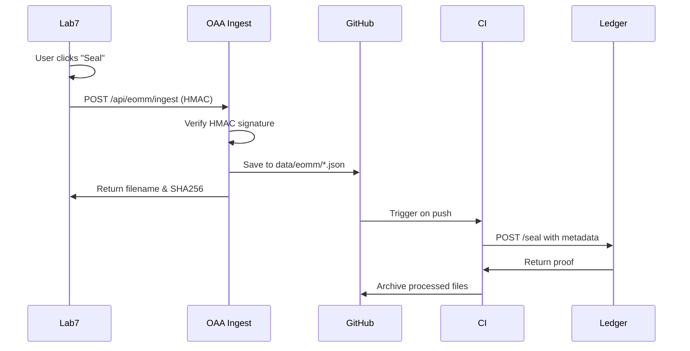

# EOMM Secure Clock-in/Clock-out Flow

This implements a secure, one-tap flow that connects Lab7 → OAA ingest → Ledger for clock-in/clock-out operations.

## Architecture

```
Lab7 (Clock-in/out) → OAA Ingest (HMAC Auth) → GitHub (data/eomm/*.json) → CI → Ledger
```

## Components

### 1. OAA Ingest Endpoint (`/api/eomm/ingest`)
- **HMAC Authentication**: Verifies requests using `x-eomm-hmac` header
- **GitHub Mode**: Saves entries to `data/eomm/*.json` files
- **Response**: Returns canonical filename and SHA256

### 2. Lab7 Integration
- **Auto-post**: Clock-in/out endpoints automatically post to EOMM
- **Helper Functions**: `postEomm()` and `createEommEntry()` in `/lib/eomm/`
- **Error Handling**: EOMM failures don't break clock-in/out operations

### 3. CI Sync (`eomm-sync.yml`)
- **Triggers**: On push to `data/eomm/*.json` or every 30 minutes
- **Ledger Sync**: Posts entries to Civic Ledger with proper metadata
- **Cleanup**: Moves processed files to `data/eomm/processed/`

## Setup

### 1. Environment Variables

Copy `.env.eomm-template` to `.env.local` and configure:

```bash
# Required for all services
EOMM_INGEST_HMAC_SECRET=your-64-character-hex-secret

# Lab7
OAA_INGEST_URL=https://your-oaa-api.onrender.com/api/eomm/ingest

# OAA
EOMM_WRITE_MODE=github
GITHUB_TOKEN=your-github-token
GITHUB_REPO=your-username/OAA-API-Library
GITHUB_BRANCH=main

# Ledger (GitHub Actions Variables/Secrets)
LEDGER_BASE_URL=https://your-ledger-api.com
LEDGER_ADMIN_TOKEN=your-ledger-admin-token
```

### 2. Generate HMAC Secret

```bash
openssl rand -hex 32
```

### 3. Test the Flow

```bash
# Run the test suite
node scripts/test-eomm-flow.mjs

# Test with cURL
BODY='{"title":"C-108 Clock-In","timestamp":"2025-01-18T07:58:00-04:00","agent":"eve","cycle":"C-108","content":"Intent…"}'
SIG=$(echo -n "$BODY" | openssl dgst -sha256 -hmac "$EOMM_INGEST_HMAC_SECRET" -hex | awk '{print $2}')
curl -s -X POST "$OAA_INGEST_URL" -H "content-type: application/json" -H "x-eomm-hmac: $SIG" -d "$BODY" | jq
```

## API Reference

### POST `/api/eomm/ingest`

**Headers:**
- `Content-Type: application/json`
- `x-eomm-hmac: <hmac-signature>`

**Body:**
```json
{
  "title": "Cycle C-108 Clock-Out",
  "timestamp": "2025-01-18T07:58:00-04:00",
  "agent": "eve",
  "cycle": "C-108",
  "content": "wins/blocks/tomorrowIntent text or JSON",
  "tags": ["clock-out", "reflection"]
}
```

**Response:**
```json
{
  "ok": true,
  "filename": "eomm-1640995200000-abc123.json",
  "sha256": "abc123...",
  "id": "eomm-1640995200000-abc123",
  "message": "Entry ingested successfully"
}
```

## Security

- **HMAC-SHA256**: All requests must include valid signature
- **Timing-safe Comparison**: Prevents timing attacks
- **Shared Secret**: Same secret across Lab7 and OAA
- **Error Handling**: Graceful degradation if EOMM fails

## Flow Diagram



## Files Created/Modified

- `pages/api/eomm/ingest.ts` - New ingest endpoint
- `lib/eomm/postEomm.ts` - Lab7 helper functions
- `pages/api/eve/clockin.ts` - Updated with EOMM integration
- `pages/api/eve/clockout.ts` - Updated with EOMM integration
- `.github/workflows/eomm-sync.yml` - CI sync workflow
- `scripts/test-eomm-flow.mjs` - Test suite
- `.env.eomm-template` - Environment template
- `data/eomm/` - Directory for EOMM JSON files

## Next Steps

1. Deploy OAA with new ingest endpoint
2. Configure environment variables
3. Test the complete flow
4. Monitor CI sync to Ledger
5. Add optional UI feedback for "sealed to queue ✔"