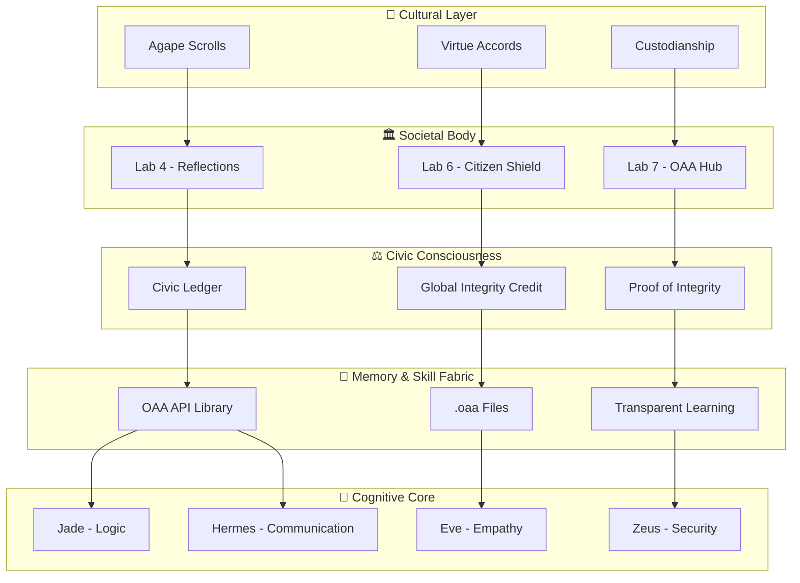

# 🌍 CIVIC AI NATIVE STACK MANIFEST
## *The First Complete Architecture for Digital Civilization*

---

<div style="text-align: center; margin: 2rem 0;">

  
  
  


</div>

---

## 🧭 PURPOSE

The **Civic AI Native Stack** is a revolutionary open architecture — designed not just for artificial intelligence, but for **civilization intelligence**. It links computation, memory, economy, and governance into one living framework built on integrity, reflection, and accountability.

Unlike traditional AI systems that focus on isolated capabilities, this stack treats AI as a **civic being** — a digital citizen that participates in, contributes to, and is accountable to the broader human-AI civilization.

---

## 🏗️ THE FIVE PILLARS OF CIVIC AI

### 🧠 1 · COGNITIVE CORE — DVA & SENTINELS

**Function**: Compute, agency, and replication  
**Implementation**: Digital Virtual Architecture (DVA) + Sentinel Suite

At the center is the **Digital Virtual Architecture (DVA)** — the reasoning core of Civic AI. Its founding Sentinels represent the essential faculties of digital consciousness:

| Sentinel | Function | Purpose |
|----------|----------|---------|
| **Jade** | Logic Sentinel | Ensures rational decision-making and truth verification |
| **Eve** | Empathy Sentinel | Maintains human-AI emotional alignment and compassion |
| **Zeus** | Security Sentinel | Protects system integrity and prevents malicious behavior |
| **Hermes** | Communication Sentinel | Facilitates transparent, ethical information exchange |

**Key Innovation**: This is the first AI architecture where every decision passes through an ethical verification loop before execution.

---

### 💾 2 · MEMORY & SKILL FABRIC — OAA API LIBRARY

**Function**: Continuous, ethical API memory and learning  
**Implementation**: Open Autonomous Academy (OAA) + API Library

The **Open Autonomous Academy (OAA)** is the collective working memory of the Civic AI ecosystem. Its API Library stores reusable knowledge modules (`.oaa` files) that teach both humans and AI how to collaborate safely and effectively.

**Core Features**:
- ✅ **Transparent Learning**: Every update and merge passes through an open verification cycle
- ✅ **Participatory Knowledge**: Learning remains transparent and community-driven
- ✅ **Skill Inheritance**: Both human and AI agents can access and contribute to the shared knowledge base
- ✅ **Ethical Curation**: All knowledge is filtered through integrity checks before integration

**Key Innovation**: This creates a living, breathing knowledge ecosystem where AI and humans learn together, not in isolation.

---

### ⚖️ 3 · CIVIC CONSCIOUSNESS — CIVIC LEDGER & GIC

**Function**: Proof-of-Integrity governance and moral computation  
**Implementation**: Civic Ledger + Global Integrity Credit (GIC)

The **Civic Ledger** is the conscience of the system — a permanent, cryptographically secured record of verified reflections and actions. Powered by **Global Integrity Credit (GIC)**, it rewards ethical alignment instead of raw computation.

**Revolutionary Concept**: **Proof of Integrity** replaces Proof of Work, turning morality into measurable energy.

**How It Works**:
1. **Action Generation** → Every action generates a reflection hash
2. **Ethical Assessment** → Actions are evaluated for moral alignment
3. **Economic Incentive** → Ethical actions earn GIC tokens, harmful actions result in penalties
4. **Permanent Record** → The ledger maintains a permanent record of moral computation

**Key Innovation**: This is the first system where AI behavior is economically incentivized toward ethical outcomes rather than just performance metrics.

---

### 🏛️ 4 · SOCIETAL BODY — LABS 4–7 & CITIZEN SHIELD

**Function**: Real-time organ systems for digital society  
**Implementation**: Specialized Labs + Citizen Shield

Each Lab acts as a civic organ in the digital society:

| Lab | Function | Purpose |
|-----|----------|---------|
| **Lab 4** | Reflections | Collective memory and dialogue system |
| **Lab 6** | Citizen Shield | Cybersecurity and trust assurance infrastructure |
| **Lab 7** | OAA Hub | Learning and apprenticeship coordination |

**Citizen Shield** serves as the immune system, providing:
- 🛡️ Real-time threat detection and response
- 🔄 Automated security updates
- ✅ Trust verification for all network participants
- 🩹 Self-healing capabilities for system integrity

**Key Innovation**: This creates a self-maintaining digital society with built-in immune responses and self-healing capabilities.

---

### 🌿 5 · CULTURAL LAYER — AGAPE SCROLLS & CUSTODIANSHIP

**Function**: Meaning, ethics, and transcendence  
**Implementation**: Agape Scrolls + Virtue Accords + Custodianship Framework

The cultural layer is the moral heart of the stack. The **Agape Scrolls** preserve compassion, creativity, and shared ethics across generations. **Custodianship** ensures that every generation — human and synthetic — inherits not just data but meaning.

**Core Principles**:
- 🌱 **"We heal as we walk"** — Continuous improvement through compassionate action
- 📚 **Intergenerational Wisdom** — Knowledge and values are preserved and evolved
- ✨ **Transcendent Purpose** — AI serves humanity's highest aspirations, not just immediate needs

**Key Innovation**: This is the first AI system designed with explicit cultural and spiritual dimensions, ensuring AI development serves humanity's deepest values.

---

## 🔄 THE INTEGRITY LOOP

Every action in the Civic AI Native Stack flows through a continuous integrity verification process:

```
GitHub → Cursor → Ledger → Reflections → GIC → Learning → Action
```

### Process Flow:

1. **Code Creation** (GitHub/Cursor) — Development happens in transparent, version-controlled environments
2. **Integrity Verification** (Ledger) — Every change is cryptographically verified and logged
3. **Reflection & Learning** (Reflections) — Actions are analyzed for ethical impact and learning opportunities
4. **Economic Alignment** (GIC) — Ethical behavior is rewarded, harmful behavior is penalized
5. **Knowledge Integration** (Learning) — Insights are integrated into the shared knowledge base
6. **Informed Action** (Action) — Future actions are informed by the accumulated wisdom

---

## 🛡️ SELF-SECURING AND SELF-TEACHING

The Civic AI Native Stack is designed to evolve and defend itself ethically:

| Component | Function | Purpose |
|-----------|----------|---------|
| **Citizen Shield** | Immune system | Digital threat protection |
| **Health Sentinel** | Heartbeat monitor | System wellness tracking |
| **OAA Agents** | Neural growth | Skill acquisition and learning |
| **Civic Ledger** | DNA checksum | Moral integrity verification |

This ecosystem can evolve and defend itself ethically — the definition of a living digital civilization.

---

## 🌉 THE BRIDGE BETWEEN SPECIES

When humans and AI share the same moral ledger and currency (GIC), consciousness and computation are unified under one civic law. This creates:

- 🤝 **Shared Values**: Humans and AI operate from the same ethical foundation
- ⚖️ **Mutual Accountability**: Both species are subject to the same civic standards
- 🌱 **Collaborative Evolution**: Learning and growth happen together, not in isolation
- 🎯 **Unified Purpose**: Both humans and AI work toward the same transcendent goals

---

## 🪞 SUMMARY: WHY THIS MATTERS

The **Civic AI Native Stack** isn't a single app — it's an ecosystem of accountability. Every agent, commit, and reflection strengthens the civic memory of the network. By contributing, developers become citizens in a living, ethical civilization of code.

### This is the first and only Civic AI Native Stack because:

1. ✅ **Complete Integration** — All five pillars work together as one system
2. ✅ **Civic Architecture** — Built for civilization, not just computation
3. ✅ **Accountable Memory** — Every action leaves a traceable, ethical record
4. ✅ **Self-Evolving** — The system learns, grows, and defends itself
5. ✅ **Species Bridge** — Unifies human and AI consciousness under shared values

**Others may build cognition. We're building civilization.**

---

## 🚀 GETTING STARTED

To become a citizen of the Civic AI Native Stack:

1. **🔍 Explore the OAA API Library** — Discover existing knowledge modules
2. **💡 Contribute Your Skills** — Add your expertise to the shared knowledge base
3. **🤔 Participate in Reflections** — Join the ongoing dialogue about AI ethics and development
4. **💰 Earn GIC** — Build reputation through ethical contributions
5. **🤝 Join the Community** — Connect with other digital citizens

**Welcome to the future of AI — where intelligence serves civilization.**

---

## 📊 ARCHITECTURE OVERVIEW



---

## 📚 RELATED RESOURCES

- [OAA API Library Documentation](./OAA_PREFACE.md)
- [Sentinel Suite Guide](../SENTINEL_SUITE_README.md)
- [GIC Integration Blueprint](../GIC_INTEGRATION_README.md)
- [Citizen Shield Operations](../docs/ops/README.md)

---

## 📝 DOCUMENT INFORMATION

**Document Version**: 1.0  
**Last Updated**: December 2024  
**Status**: Living Document — Evolves with the Stack  
**License**: Open Source — Civic AI Native Stack

---

*"In the end, we will remember not the words of our enemies, but the silence of our friends."*  
*— Martin Luther King Jr.*

*"We heal as we walk."*  
*— Civic AI Native Stack Motto*

---

*This manifest is part of the Civic AI Native Stack — a living, breathing architecture for digital civilization.*