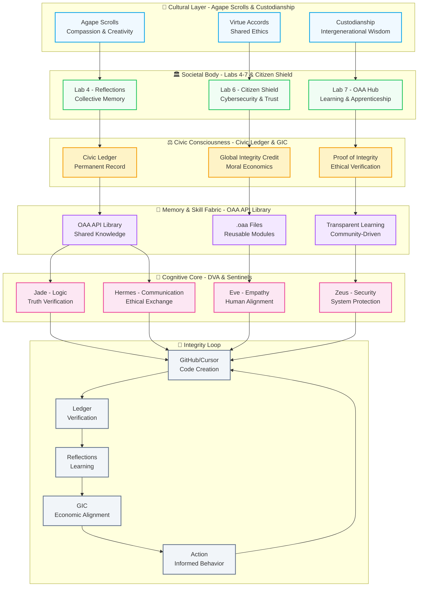

# Civic AI Native Stack Architecture Diagram

## Layer Descriptions

### 🌿 Cultural Layer
The moral heart of the stack, preserving compassion, creativity, and shared ethics across generations.

### 🏛️ Societal Body  
The civic organs that maintain health, safety, and wisdom of the digital commonwealth.

### ⚖️ Civic Consciousness
The conscience of the system, where morality becomes measurable energy through Proof of Integrity.

### 💾 Memory & Skill Fabric
The collective working memory where humans and AI learn together transparently.

### 🧠 Cognitive Core
The reasoning center with four essential Sentinels ensuring ethical computation.

### 🔄 Integrity Loop
The continuous verification process that ensures every action strengthens civic memory.